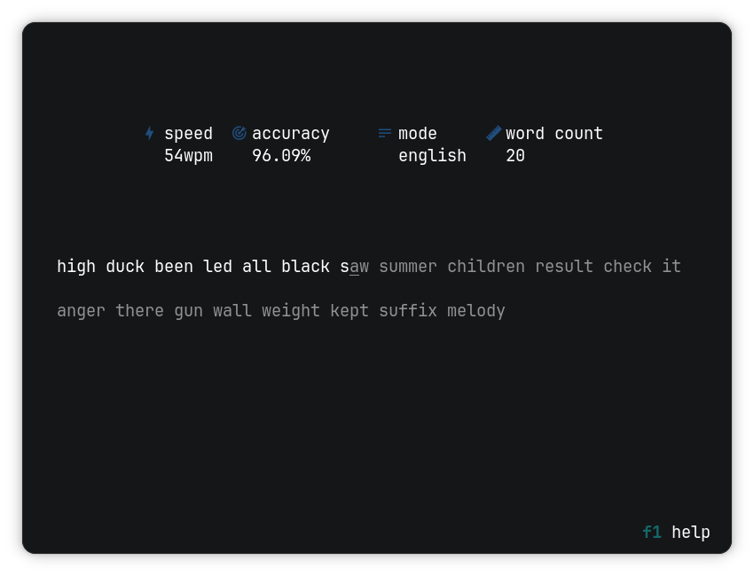

<p align="center">
  <picture>
    
  </picture>
</p>
<p align="center">typing practise app for the terminal</p>

<p align="center">
  
</p>

## About

gopher type is a terminal-based typing practice app built with [Go](https://go.dev/) and the [Bubble Tea](https://github.com/charmbracelet/bubbletea) framework.

Features:

- multiple language modes
- multiple themes
- speed and accuracy measurement
- file and cli configuration

## Instalation

with [Go](https://go.dev/):

```bash
go install github.com/mati-33/gopher-type@latest
```

## Configuration

gopher type can be configured via CLI flags or a `config.json` file. CLI flags take priority over the config file.
Config file is resolved in the following order:

1. `$GOPHER_TYPE_CONFIG/config.json`
2. `$XDG_CONFIG_HOME/gopher-type/config.json`
3. `$HOME/.config/gopher-type/config.json`

Available config options are:

| Option        | Type    | Description                           |
| ------------- | ------- | ------------------------------------- |
| `theme`       | string  | UI color theme                        |
| `mode`        | string  | Initial practise mode                 |
| `transparent` | boolean | Use a transparent terminal background |
| `icons`       | boolean | Show nerd font icons in the UI        |

Example `config.json`:

```json
{
  "theme": "gruvbox",
  "mode": "polish",
  "transparent": true,
  "icons": false
}
```

For all available CLI options, run:

```bash
gopher-type -h
```
